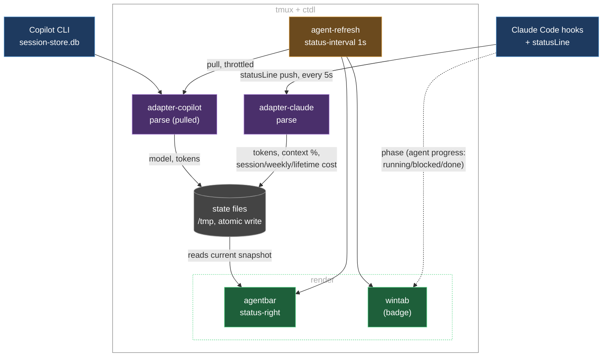

# tmux-ctdl

**ctdl** = **C**oding **T**mux **D**ev **L**ayout. A tmux dev layout for
working with a coding agent (Claude Code, GitHub Copilot CLI), plus a status
bar showing usage/cost and a per-window badge showing what each agent is
doing.

## What you get

Run `ctdl` in a tmux window and it splits into three panes:

```
┌─────────────┬────────────────┐
│             │  change        │
│  coding     │  tracker       │
│  agent      │  (lazygit)     │
│  (claude)   ├────────────────┤
│             │  terminal      │
└─────────────┴────────────────┘
```

- **Left**: your coding agent (`AGENT_CMD`, `claude` by default)
- **Top right**: change tracker (`CHANGE_TRACKER_CMD`, `lazygit` by default)
- **Bottom right**: plain terminal

**prefix + Space** respawns the top-right pane in place (`respawn-pane -k`),
flipping it between `CHANGE_TRACKER_CMD` and `EDITOR_CMD` (`nvim` by
default) — it's a swap, not a new split. Left/bottom-right panes untouched.
A per-window flag (`@change_tracker_state`) remembers which one is showing.

**prefix + C** kills and restarts the left pane with `AGENT_CMD` — for when
the agent process wedges.

The outer status bar shows the agent's context window, usage/cost, and (for
Claude) a running lifetime total. Each window also gets a small badge next to
its name showing whether the agent in it is running, waiting on you, or done.

`ctdlm` ("multi") does this for every git repo under a directory at once —
one `ctdl` window per repo. Give it more than one directory
(`ctdlm ~/Development ~/Development/ha`) and each one gets its own tmux
session, still one window per repo inside it.

## Install

```sh
git clone <this-repo> ~/Development/tmux-ctdl   # or wherever
cd ~/Development/tmux-ctdl
./install.sh
```

Deploys this repo to `$TMUX_CTDL_HOME` (default `~/.config/tmux/tmux-ctdl`)
and appends integration snippets — marked, idempotent, safe to re-run — to:

- `~/.config/zsh/.zshrc` — sources `tmux-ctdl.sh`, defines `dev` alias
- `~/.config/tmux/tmux.conf` — 2 keybinds, 2 status-format lines (tmux also
  needs `set -g status 2` and `status-interval 1` set somewhere — not
  appended, likely already in your tmux.conf)
- `~/.claude/settings.json` — hooks + statusLine, merged via `jq` (backup
  written alongside; requires `jq`, else prints the manual patch path)

Raw snippets live in [`integrations/`](integrations/) if you'd rather apply
by hand. Per-agent wiring detail: [`docs/agents/claude.md`](docs/agents/claude.md),
[`docs/agents/copilot.md`](docs/agents/copilot.md).

## Configure

Edit `tmux-ctdl.conf` (deployed to `$TMUX_CTDL_HOME/tmux-ctdl.conf` on first
install, then left alone on every reinstall after):

- `CODING_AGENT` — `claude` or `copilot`
- `AGENT_CMD` — the command that starts your agent in the left pane
- `CHANGE_TRACKER_CMD` / `EDITOR_CMD` — what the top-right pane runs, and
  what it swaps to on toggle
- colours/thresholds for the status bar — every one has a default, only
  name the ones you want different

## Usage

- `ctdl` — build the 3-pane layout in the current tmux window
- `ctdlm [dir...]` — one `ctdl` window per git repo under a dir (current dir,
  or `~/Development` if it has none); multiple dirs each get their own
  session. Works outside tmux too — starts one and re-enters.
- **prefix + Space** — swap the top-right pane between change tracker and
  editor
- **prefix + C** — restart the agent pane

## How data flows

**Hooks in.** Claude Code is push-based: `~/.claude/settings.json` (deployed
by install.sh) wires `SessionStart` / `UserPromptSubmit` / `Stop` /
`Notification` / `PermissionRequest` straight to `tmux-ctdl.sh wintab-badge`,
plus a 5s-interval `statusLine` to `tmux-ctdl.sh agent-push-usage`. Copilot
CLI has no hook mechanism, so it's pulled instead — polled from
`~/.copilot/session-store.db` on the scheduler tick below. One consequence:
window badges (next section) only work for Claude.

**Storage.** Everything lands as plain files under `AGENT_TMP_DIR` (`/tmp`
by default), written atomically. No tmux user options, no sockets. A reaper
sweeps stale files every 10 minutes.

**agent-refresh.** tmux's own `status-interval 1` fires this verb once a
second. It advances the badge animation, pulls Copilot usage (throttled to
once a minute), and reaps stale state (throttled to once per 10 minutes).

**Rendering out.** The status-right segment (agentbar) re-reads state and
repaints every second: usage, cost, context gauge. Window badges are written
straight onto the tmux window name the moment a hook event or tick changes
an agent's phase — no separate render pass.



## Tests

```sh
bash tests/run-tests.sh          # discovers every test-*.sh under tests/
bash tests/run-coverage.sh       # kcov, writes .coverage/
```

Local git hooks (pre-commit: shfmt + shellcheck + tests; pre-push: 100% coverage
gate) live in `.githooks/` — enable once per clone:

```sh
git config core.hooksPath .githooks
```
