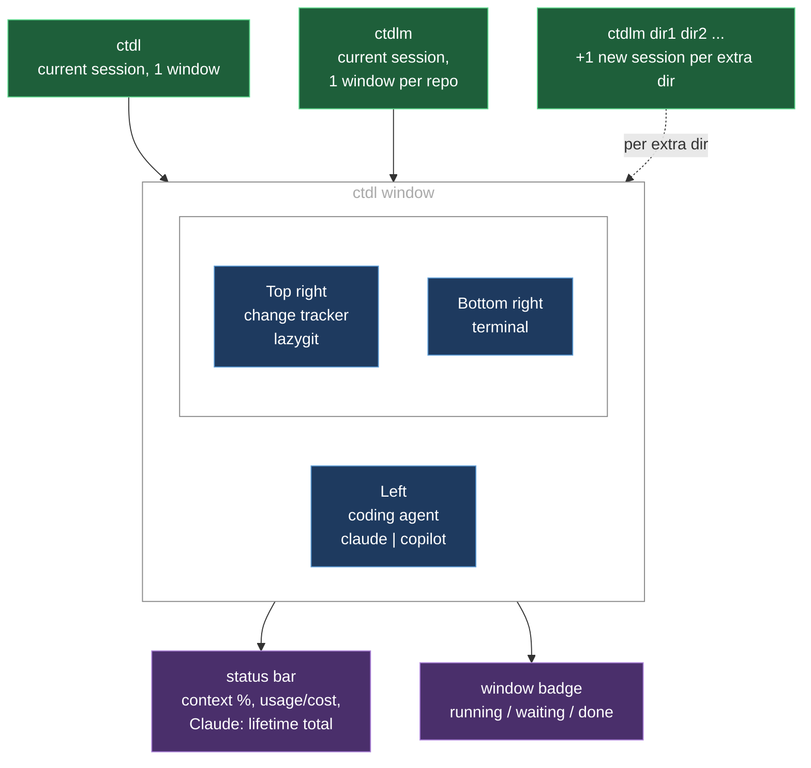
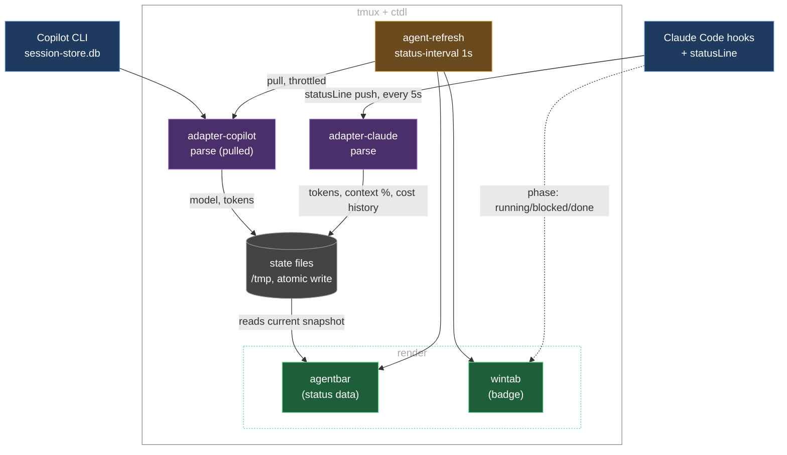

# tmux-ctdl

**ctdl** = **C**oding **T**mux **D**ev **L**ayout. A tmux dev layout for
working with a coding agent (Claude Code, GitHub Copilot CLI), plus a status
bar showing usage/cost and a per-window badge showing what each agent is
doing.

## What you get

Run `ctdl` in a tmux window and it splits into three panes:



**Key bindings**

| Key | Pane | Runs | Effect |
|---|---|---|---|
| prefix + C | Left | `AGENT_CMD` (`claude`) | kill + restart the pane |
| prefix + Space | Top right | `CHANGE_TRACKER_CMD` (`lazygit`) ↔ `EDITOR_CMD` (`nvim`) | respawn-swap in place, not a new split |

## Install

```sh
git clone https://github.com/marcintk/tmux-ctdl.git <DIR>
cd <DIR>
./install.sh
```

Deploys to `$TMUX_CTDL_HOME` (default `~/.config/tmux/tmux-ctdl`), patches
(idempotent, safe to re-run):

| File | Snippet | Note |
|---|---|---|
| `~/.config/zsh/.zshrc` | [`integrations/zshrc.sh`](integrations/zshrc.sh) | |
| `~/.config/tmux/tmux.conf` | [`integrations/tmux.conf`](integrations/tmux.conf) | |
| `~/.claude/settings.json` | [`integrations/claude-settings.json`](integrations/claude-settings.json) | needs `jq` |

## Configure

Edit `tmux-ctdl.conf` (deployed to `$TMUX_CTDL_HOME/tmux-ctdl.conf` on first
install, then left alone on every reinstall after):

| Var | Meaning |
|---|---|
| `CODING_AGENT` | `claude` or `copilot` |
| `AGENT_CMD` | command that starts your agent in the left pane |
| `CHANGE_TRACKER_CMD` / `EDITOR_CMD` | what the top-right pane runs, and what it swaps to on toggle |
| status bar colours/thresholds | every one has a default, only name the ones you want different |

## How data flows



## Development

Needs: `bash`, `kcov`, `shfmt`, `shellcheck`.

```sh
bash tests/run-tests.sh          # discovers every test-*.sh under tests/
bash tests/run-coverage.sh       # kcov, writes .coverage/
```

| Hook | Runs |
|---|---|
| pre-commit | shfmt + shellcheck + tests |
| pre-push | 100% coverage gate (`kcov`) |

Enable once per clone:

```sh
./dev_setup.sh
```
