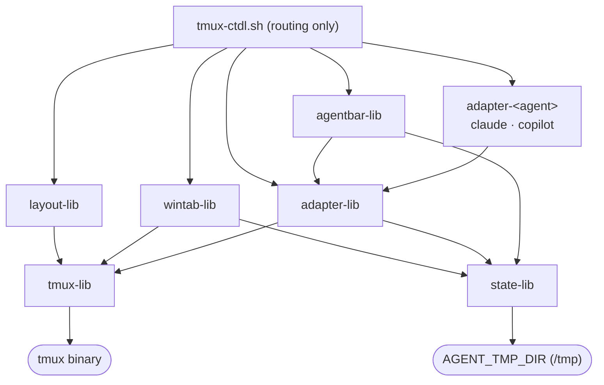
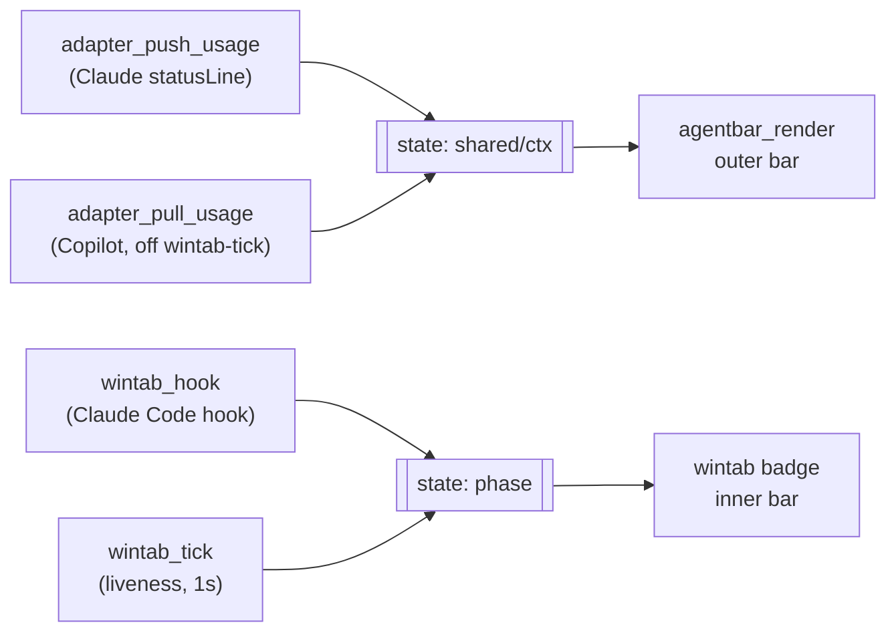

# tmux-ctdl

**ctdl** = **C**oding **T**mux **D**ev **L**ayout — the name of the script
and shell functions (`ctdl`/`ctdlm`) this repo ships. `tmux-ctdl` is the repo
name (searchable, states its home); `ctdl` stays the command you actually
type.

tmux dev layout (`ctdl`) + agent status bar/badges for Claude Code and
Copilot. Everything boots through `tmux-ctdl-boot.sh`, which reads
`tmux-ctdl.conf` then sources requested libs by name (`tmux`, `state`,
`layout`, `adapter`, `wintab`, `agentbar`) — no caller hardcodes a path
except `tmux-ctdl.sh` itself. A lib needing another lib calls `tmux_ctdl_boot`
itself (idempotent, so re-requesting an already-loaded lib is free).

## Install

```sh
git clone <this-repo> ~/Development/tmux-ctdl   # or wherever
cd ~/Development/tmux-ctdl
./install.sh
```

Deploys this repo to `$TMUX_CTDL_HOME` (default `~/.config/tmux/workspace`)
and appends integration snippets — marked, idempotent, safe to re-run — to:

- `~/.config/zsh/.zshrc` — sources `tmux-ctdl.sh`, defines `dev` alias
- `~/.config/tmux/tmux.conf` — 2 keybinds, 2 status-format lines (tmux also
  needs `set -g status 2` and `status-interval 1` set somewhere — not
  appended, likely already in your tmux.conf)
- `~/.claude/settings.json` — hooks + statusLine, merged via `jq` (backup
  written alongside; requires `jq`, else prints the manual patch path)

Raw snippets live in [`integrations/`](integrations/) if you'd rather apply
by hand. Per-agent wiring detail: [`docs/agents/claude.md`](docs/agents/claude.md),
[`docs/agents/copilot.md`](docs/agents/copilot.md). Edit `tmux-ctdl.conf` to
pick `CODING_AGENT` — the installer deploys it as-is on first install and
leaves your copy at `$TARGET/tmux-ctdl.conf` alone on every reinstall after.

## Entry point

**`tmux-ctdl.sh`** is the only file any external system calls — tmux keybinds,
tmux status-formats, Claude Code hooks.

**Sourced** (shell rc): `source ~/.config/tmux/workspace/tmux-ctdl.sh` defines
`ctdl` (build 3-pane layout: agent / change-tracker / terminal) and `ctdlm`
("multi" — one `ctdl` window per git workspace under the current dir, or
`~/Development`; works outside tmux too, re-invokes itself inside a new session).

**Executed** (`tmux-ctdl.sh <verb> [args]`):

| Verb | Calls | Used by |
|---|---|---|
| `tracker-editor-toggle <pane_id>` | `layout_toggle` | tmux `bind-key Space` |
| `agent-respawn <pane_id>` | `layout_respawn_agent` | tmux `bind C` |
| `wintab-tick <session>` | `wintab_tick` → `adapter_pull_usage` → `state_reap_stale` (own interval) | tmux `status-format[0]`, 1s |
| `agentbar <sess> <win>` | `agentbar_render` | tmux `status-format[1]` |
| `wintab-badge <RUNNING\|CLEAR\|DONE\|PERMISSION>` | `wintab_hook` | Claude Code hooks |
| `agent-push-usage` | `adapter_push_usage` | Claude `statusLine` (stdin JSON) |
| `agent-footer` | `adapter_footer` | Claude `Stop` hook (stdin JSON, stdout answer) |
| `agent-pull-usage` | `adapter_pull_usage` | `wintab-tick`, rate-limited by `USAGE_REFRESH` (Copilot has no hooks, so it's polled) |

`badge`/`push`/`pull` act on `CODING_AGENT` (`tmux-ctdl.conf`) — no agent arg,
one active agent's hooks assumed wired at a time.

## Directory layout

```
tmux-ctdl/
  tmux-ctdl.sh        external entry point: sourceable (ctdl, ctdlm) + executable (verbs)
  tmux-ctdl-boot.sh   the one way into the runtime; loads conf + libs
  tmux-ctdl.conf      active agent, editor/tracker commands, timing — overrides only,
                      every colour/threshold defaults at the module that reads it
  libs/
    tmux-lib.sh       only module that knows tmux syntax + where "here" is
    state-lib.sh      agent state store (get/put/mark/clear/exists/age) + reap_stale
    layout-lib.sh     pane layout verbs, owns tmux window options
  adapter/            per-agent identity: adapter-lib.sh (shared) + adapter-<agent>.sh
  agentbar/           outer status bar (usage/cost) — agentbar-lib.sh, verbs only
  wintab/             inner status bar (per-window badge) — wintab-lib.sh, verbs only
  tests/              mirrors adapter/, agentbar/, wintab/, libs/ one-for-one
```

Naming: **area** = module dir (`layout · state · tmux · adapter · wintab ·
agentbar`); **role** = `-lib` (sourceable verbs, no load-time side effects) or
a verb name under `tmux-ctdl.sh`. No mechanism words (`hook`/`poll`/`cleanup`) in
filenames — those describe the caller, not the code.

## Module wiring



## State: two bars, one store

Nothing renders from a live process. Every writer puts state through
`state-lib`, every reader pulls it back on its own clock — so a 1s status
format never waits on `jq`/`sqlite3`/`ccusage`. Claude **pushes** usage via
`statusLine` on every turn; Copilot has no hook, so it's **pulled** —
`wintab-tick` calls `adapter_pull_usage`, rate-limited by `USAGE_REFRESH`,
which runs a read-only query against Copilot's `session-store.db`. Which path
an agent gets is decided by one fact: does it define `<agent>_collect`?



Badge (`phase`) and usage (`shared`/`ctx`) never touch: inner bar answers *is
this agent alive*, outer bar answers *what has it cost, how full is context*.

### Per-agent contract (`adapter/adapter-lib.sh` header)

| Piece | Required? | Claude | Copilot |
|---|---|---|---|
| `AGENT_LABEL`, `AGENT_CMD` | yes | set | set |
| `<agent>_collect` | pull agents only | omitted (push) | reads `session-store.db` |
| `<agent>_parse_shared` | yes | real | model/effort real, usage% blank (no quota endpoint) |
| `<agent>_parse_context` | yes (stub OK) | real | stub — no context telemetry in db |
| `<agent>_live_cwds` | yes | `~/.claude/sessions/*.json` | `pgrep -x copilot` — unreliable once wrapper execs into node |
| `<agent>_incoming_stale` | push agents only | yes | n/a |
| `<agent>_refresh_costs` | if billed in $ | yes (`ccusage`) | omitted (AI credits) |
| `<agent>_footer` | if it has an end-of-turn hook | yes | omitted — no hook mechanism |

State is namespaced `<kind> <agent> [keys...]`, so agents never collide.

## Tests

```sh
bash tests/run-tests.sh          # discovers every test-*.sh under tests/
bash tests/run-coverage.sh       # kcov, writes .coverage/
```
